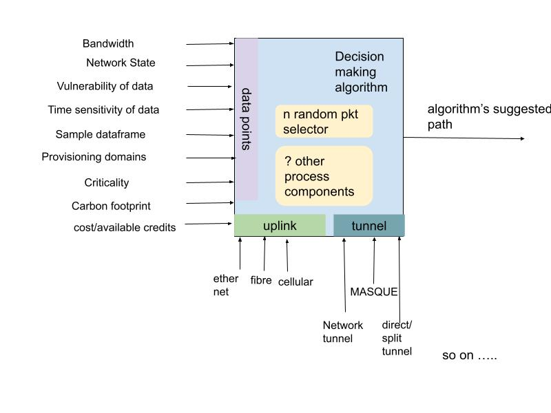
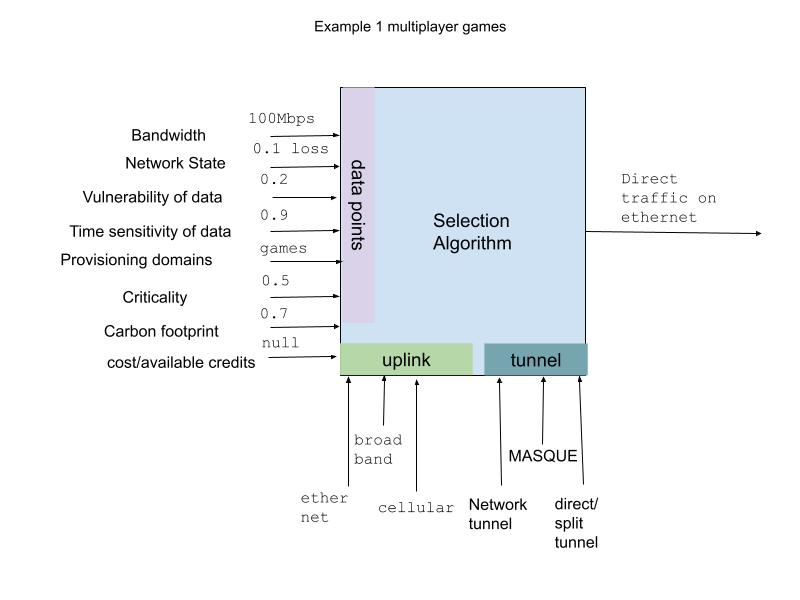
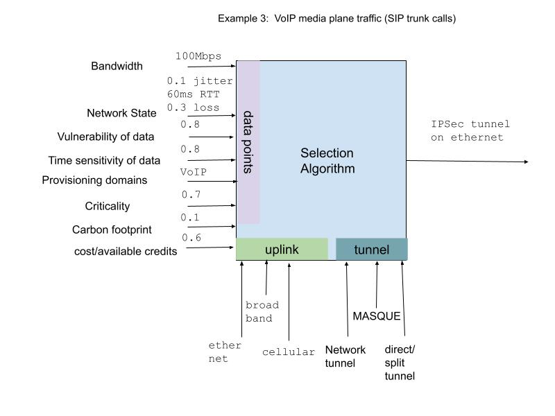
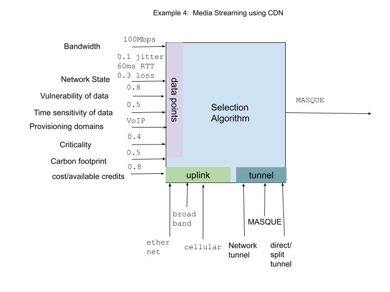

---
title: "Multipath Nested Tunnels"
abbrev: "TODO - Abbreviation"
category: info

docname: draft-altanai-tsv-multipath_nested_tunnels-latest
submissiontype: IETF  # also: "independent", "editorial", "IAB", or "IRTF"
number:
date:
consensus: true
v: 3
area: "Internet Engineering Steering Group"
workgroup: "Transport Area"
keyword:
 - MASQUE
 - VPN
 - IPSec
 - Network Tunnelling protocols
venue:
  group: "Transport Area"
  type: "Area"
  mail: ""
  arch: ""
  github: "altanai/multipath-nested-tunnels"
  latest: "https://altanai.github.io/multipath-nested-tunnels/draft-altanai-tsv-multipath_nested_tunnels.html"

author:
 -
    fullname: Altanai Bisht
    organization: Cisco Meraki
    email: albisht@cisco.com

normative:

informative:

--- abstract

This document identifies the real world problem of choosing a path when among simultaneously available multiple paths. It then shows the interoperability issues in multilevel tunnels on these paths, highlighting the shortcoming of the existing approaches to meet the load sharing and prioritization requirements. It proposes a holistic algorithmic approach to the decision making process.

--- middle

# Introduction 

A path for sending data across a network can consist of a combination of many factors such as uplink, application layer protocol, tunneling protocol among others. For example TLS  operates above the network layer, SSH and Secure Real-time Transport Protocol (SRTP) [RFC 5764] operates at the application layer to carry data. Stream Control Transmission Protocol (SCTP), intended to tunnel signaling messages over IP networks, can encapsulate data as well. Tunneling can build a secure interconnection called Virtual Private Network(VPN) that provides a private subnet to pass traffic between the tunneled endpoints. This setup caters to enterprises and small private home networks alike. The protocols for such network level tunneling may include GRE, L2P, IPSec, WireGuard, OpenVPN and even proprietary protocols such as AutoVPN or custom implementtion over DTLS. Now multiple proxied stream- and datagram-based flows are possible inside an HTTP connection through the MASQUE which is build on QUIC. However there may be real world use-cases where network tunnels could nest application tunnels, which leads to large overheads in latency and quality of data. 

# Problem Statement

Many network service providers create sharing and resiliency by making traffic to be split, load balanced across multiple uplinks or failover to standby when any of the exisitng uplinks fail. Many mordern implementations use traffic shaping policies based on the network metrics such as loss, latency. Others can  prioritize flows based on intelligent classification ML models. There are many application specific logic that improve the selection process and also encourage fairness however such system designs lacks reusability on both the control and data plane.

## Path discovery and resulting conflicts 

Networking protocols use hole punching to setup a path between endpoints. In presence of multiple paths available between two endpoints , multiple tunnels may be formed for primary-standby or load sharing setup. However QUIC's path discovery to explore reacahble endpoints for MASQUE proxy there may be 

## Setup and tear down 

Network level tunnels encrypt and encapsulate the payload (data send by client) in UDP with headers designed to route effectively within VPN core network towards the egree point. The treatment of traffic includes ACL checks as well as other IPM( intriusion prevention ) as per the policy or firewall rules.
The VPN gateways can either load share or selectively choose best path to route the traffic through the avaiable tunnels or use split tunnel to selectively bypass the VPN core altogether. These VPN's are often stateless which identify the tunnels using 4 or 5 tupple mappings. 

## Processing overhead 

Nested tunnels greatly impact the traffic quality often resulting in fragmentation and defragmentation, as well as computational overhead in multiple encapsulations which incrreases the processor workload.

## MTU and Fragmentation 

QUIC has set MTU size limits and UDP in contrast has a large limit. As opposed to this a non-tunneled traffic has lesser MTU restrictions and thus saves up processing time on fragmentation and defragmentation. Prior work has been done on the subject such as MTU and fragmentation considerations for In-the-Network Tunneling [RFC4459] 

## Increased Latency

Considering limited bandwidth, with the overhead involved with nested tunnels and path selection the time sensitive streams are impacted.

## Multilevel congestion control 

There are potential issues of 
The inner tunnel carrying multiplexed streams may imply congestion control assuming it contesting with competeing traffic. However in reality could be one of the multiplxed streams. Alternatively even in a standalone tunnel the the individual streams may experience delay in RTT due to queuing in the tunnel's buffers and thus assume competeing traffic and congestion control or rate optimization algorithm could kick in. 

## Prioritization 

Mainstream techniques such as packet marking( DSCP, ECN so on ) and queuing of other non-critical traffic (Fq-CODEL, CAKE AQM) to optimize for realtime streams is essentially prioritization in practice. However, VPN providers, CSPs and/or ISP may employ polar-opposite algorithms to shape traffic based on their interest which could lead to  an overall non-synchronized approach, where a stream is prioritized in some networks and deprioritized in other networks. 

## Past proposals for prioritiztion or path selection

detrimental
Some prior work presented to IETF with the inevitable need for traffic shaping and prioritiation may include one or more of the following 

At present, in the case of multiple active uplinks connecting to various ISPs, there are multiple techniques to steer or prioritize traffic across the network[https://datatracker.ietf.org/doc/draft-ietf-intarea-tunnels/], which may include, 

### 1: Full or Split tunnel based on Diff Serv via Differentiated Services Code Point (DSCP)

RFC 3270 defines how to support the Diffserv architecture in MPLS networks, including how to encode DSCP in an MPLS header. Application priorities even though using the same protocol have also been used to mark the packets differently such as DSCP Packet Markings for WebRTC QoS [RFC8807].
An example of path selection based on prioritiztion is that in case of dual uplinks available hosting an active tunnel tunnel each, use the one more with better performance for RTP since that is more prirotized over FTP data. 
    - (+) widely adopted
    - (-) Unreliable in some cases and network operator may choose not to honor markings 
    - (-) coarse grained classification 
    
### 2: Multiple Active VPN Uplinks used in weighted round robin order or ECMP 

Traffic Shaping generic rules can be based on QoS such as MOS, loss, latency, jitter, usage history, throughput on all VPN sessions or other customized score. Attributes such as app type, address or even client identifier such as mac address can be used to balace load accross available options.  
    - (+) fair by design
    - (-) can lead to detrimental user experience 
    
### 3. Policy-Based routing that use flow preferences to pin traffic to a particular path
It is common for device or network policy to manage network flows such as bandwidth allocation or rate limiting, Geo or proximity based rules. At the device level these policies may prioritize some packets over others to avoid queing delay. Modern hybrid deployments employ many uplinks with a varity of traffic shaping policies which can be adjusted dynmaically not only based on Qos but also on hop-by-hop insights from network, tracking uplink's utilization, uptime, failure or outages.
    - (+) simple
    - (-) not scalable

### 4. Dynamic Path Selection with application or domain identification 

The aplication knows its type and can directly feed the information to the algorithm. If the sender is not aware of the application it can attempt to obtain this information from intelligent ML models as Network Based Application Recognition (NBAR) from Cisco. Models exist that can suggest bottlenecks for a traffic type on a path by analysising patterns.
Dynamic path selection can even rely on explicitly identifying Provisioning Domain Names through a Router Advertisement (RA) option. Discovering Provisioning Domain Names and Data, its architecture involving the authenticatio and trust model has been decribed in prior work [RFC8801, RFC7556] 

### 5. MASQUE (QUIC multiplexing) for all Web trafic 

    - (+) handles both reliable and unreliable data
    - (-) not suited for non web based traffic

### 6. Whitelist for IP address or tuples to prioritize

    - (+) simple
    - (-) not scalable

### 7. Entropy headers

Entropy headers are extension to traditional packet header that include information about the randomness of the packet's payload. These help distributing traffic more evenly in a multipath network, mitigating the risk of hotspots and potential congestion points.
    - (+) by making these headers non-updatable they can be safe from in-path modification
    - (-) can be a privacy concern
    
### 8. Tunnelling of Explicit Congestion Notification(ECN)

Addition of ECN to IP [RFC3168] paved the way for much  optimization in managing queues based on these marking. RFC 6040 descibes the problems related to obscured original ECN markings in tunneled traffic. It proposes a standard for tunnels to propagate an extra level of congestion severity.
    - (+) Existing stanadrds exists
    - (-) complicated for nested tunnels 

### 8. Flow labelling or classification for traffic steering

     - (+) scope of applying artifically intelligent machine learning  models
     - (-) can compromise privacy

# Proposal to standardise the selection algorithm

The VPN can be considered a limited premium network that protects confidential information of an organization such as business communication between retail stores. Hybrid work and move towards private access has increased the interest in tunneling traffic between endpoints. However at present, the traffic steering decision is made in a limited scoped or rule based manner which is different for various networks and service providers. Instead an alternative dynamic strategy is proposed which gauges the confidence in the various available options dynamically and may choose to send data directly via edge gateway, use one or more of the available tunnels or create a new on-demand tunnel, leveraging any of the tunneling protocols best suited.  

By dynamically deciding the tunnel type for a stream or packet, we could avoid the non-performing or counter-productive use-cases such as 
* added latency on real time streaming 
* added encryption for already end-to-end encrypted VoIP calls 
* NAT traversal nightmare 
* nested tunneling and double congestion control 
* exhausting limited bandwidth available from VPN providers 

The proposal is to standardize an algorithm that computes multiple available options and decides whether, on-demand tunnels are created (via  MASQUE, IPSec, SSH, GRE other proprietary protocols such as AutoVPN), an existing set of tunnels be reused or any other route, based on the current network dynamics and vulnerability of the traffic. 
Standardized Path selection decision making making algorithm would ensure same treatment of the stream across heterogeneous networks. 

A suggestive, non-exhaustive list of input datapoints for the algorithm :
1. Available bandwith in bits per second, which can be obtained to bandwith estimation algorithms or implied by other metrics such as BandWidth Delay product(BDP) or even observed instantenous throughput that forms the core of many Congestion-control algorithms. 
2. Provisioning domains (PvD)
3. Network state : Telemetrics data about the health of the network.
 YANG models telemetry information such as 
4. Vulnerabilty of Data in double precesion decimal value between 0 and 1. For example in case of an end-to-end encrypted datastream over DTLS would have a low vulnerabilty score than plaintext data.
5. Time sensitivity of data : Many drafts and proposals reserve networ resources or prioritze critical support traffic such as E911. While the time sensitivity is subjected to application's decision and a machine learning models can be supervised to classify imposters, the proposed algorithm does not suggest a way to compute this value itself.   
6. carbon footprint is an optional data point that may be added to algorithim. The data for the carbon footprint can be based on multiple factors which may include Datacenter's carbon footprint, energy grid's instantenous carbon footprint for fuel mix, sender's application or network provider's carbon footprint among other options.
7. Cost or available credits

  
Prior work that standardized algorithms for networking include 
- Happy Eyeballs [RFC6555, RFC8305]  algorithm for dual-stack hosts

## Design goals 

Application do not need to understand Failover Groups with multiple uplinks.
Avoid strict priority ordering of multiple paths.
Avoid static scheduling algorithms such as weighted round robin which do not benifit mnay usecases such as low latency path for time-sensitive data. 
Other indirect impacts of the algorithm may also be to overcome strategies which unfairly maximize bandwidth usage in the public internet. 

## Algorithm's Requirements

The algorithm has primary goal of optimization the network path for the traffic stream for achieving the best result in terms of fairness and criticality. 
This algorithm must be implemented on a stateful system where the sender can make decisions on the path to be traversed. 

The algorithm requires prior categorization pf paths such as uplinks based on their characteristics as type and bandwidth for example ethernet/10 megabit per second or cellular/5 megabit per second. The algorithm also requires available tunneling protocols for data transfer such as GRE, L2P, IPSec, OpenVPN and even propertiary protocols such as AutoVPN as avaiable.

The algorithm doesnt involve the approach to break out critical traffic from non-critical traffic. Some approaches to do that have been summarized in following documents:-

The algorithm should fairly suggest critical traffic to be passed through the available best path or failover to best path when experincing issues such as loss, jitter on current path.

It should 
- encourage load sharing between available paths
- collect all data points in realtime
- weights for various data points must be adjustable
- have the ability to input feedback from observed performance which may be due to nested congestion control or multi-layer redudnant security etc

It should not 
- cause a surge of unnecessary traffic
- be impacted by NAT setups
- impact the outbound firewall policies

##  Implementation Strategies 
The simplest venue for the implementation of the Path selection algorithm is within the application itself. 

- Minimal OS support : This algorithm require no specific support from the operating system beyond the commonly available APIs that provide transport service.

- Feedback loop : The algorithm has feedback on the path consumed by all applications for this sender and tries to balance the utilization by load balacing between them.
The proposed path selection algorithm is only tasked with suggesting the protocol and path and can be overridden by the application.

- Course correction : While the algorithm relies on the data points to suggest a transport protocol on a link, it can also be misguided by ambiguous or untrust worthy input. The algorithm should be self correcting with the help of feedback and any course correction should minimally impact  cross traffic.
 
Examples of the decision that may be taken by the standardized algorithm could include:
- Example 1 : Resource intensive ultra low latency application benefit from direct internet connection such as multiplayer games and if the algorithm's path suggestion doesn't meet the latency target the application can select its own path.

- Example 2 :  VoIP signaling traffic in case of E911 benefit from direct non-tunneled setup such as shown below. Additionally the media could be shared on WebRTC’s SRTP/DTLS format which creates a peer-to-peer path to tunnel media traffic.

  
- Example 3 : SIP trunk calls may actually benefit from a dedicated IPSec tunnel, pre NATed, pre authenticated and secure, as it would avoid the delay in resetting the path given the volume of calls expected between two endpoints.

 
- Example 4 : Heavy file downloads such as VoD could benefit by load sharing between multiple tunnels.

- Example 5 : Management Information Base(MiB) for Internet Small Computer System Interface (iSCSI) can be sent over IpSec Tunnel for longer haul networks such as accross datacentres.

### Edge cases 
- Missing Datapoints : In the edge case where  there are no other data points to compute the selection logic then every avaiable concurrent path would get a weighted proportion of traffic based on its bandwidth cap. For example if a system has 2 uplinks capable of tunneling trafic with 25Mbps and 75Mbps then uplink 1 will get 25% of the flows while uplink 2 gets 75%.   

- Fail over : In the case, 1 out of the 2 uplink paths being monitored by the algorithm fail, it would then attempt to shape the traffic such that 100% of the load ends up on the same uplink. Note that even on the same uplink the algorithm can suggest different protocols such as Network tunnel, aplication specific tunnel over HTTP proxy or even open access based on the data points. 

# Conventions and Definitions

{::boilerplate bcp14-tagged}

# Security Considerations {#security}
While there is large scope for improvements in the draft, the main crux is to build a trust model between the tunneling layers that avoids the need for multiple layers of tunneling or cryptographic protocols. The selection of split tunnel by the algorithm could make the traffic more vulnearble to security risk. For example in an enterprise VPN system, a aplit tunnel could mean bypasing the firewalls rules and other threast prevention logic. Split tunnel for a regular user could means vulnerabilty to pattern analysis by third parties such as ISP, government survior network admin.

# IANA Considerations {#iana}

This document has no IANA actions.

--- back

# Acknowledgments
{:numbered="false"}

TODO acknowledge.
